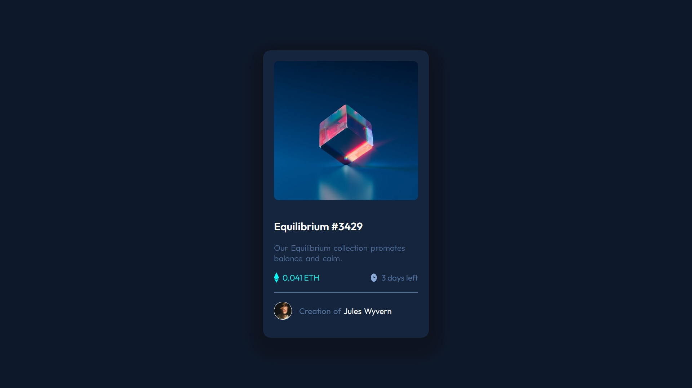

# Frontend Mentor - NFT preview card component solution

This is a solution to the [NFT preview card component challenge on Frontend Mentor](https://www.frontendmentor.io/challenges/nft-preview-card-component-SbdUL_w0U). Frontend Mentor challenges help you improve your coding skills by building realistic projects.

## Table of contents

- [Overview](#overview)
  - [The challenge](#the-challenge)
  - [Screenshot](#screenshot)
  - [Links](#links)
- [My process](#my-process)
  - [Built with](#built-with)
  - [What I learned](#what-i-learned)
  - [Continued development](#continued-development)
  - [Useful resources](#useful-resources)
- [Author](#author)

**Note: Delete this note and update the table of contents based on what sections you keep.**

## Overview

### The challenge

Users should be able to:

- View the optimal layout depending on their device's screen size
- See hover states for interactive elements

### Screenshot

### Links

- Solution URL: [Code](https://github.com/mandopr/nft-preview-card-component)
- Live Site URL: [Live Site](https://mandopr.github.io/nft-preview-card-component/)

## My process

### Built with

- Semantic HTML5 markup
- CSS custom properties
- Flexbox

### What I learned

Through this challenge I learned flexbox thoroughly and also box-shadow. I realised how amazing they both are.

### Continued development

I think I have to focus more on giving dimesion stuff like it become cumbersome for me to get through it.

### Useful resources

- [Flexbox](https://css-tricks.com/snippets/css/a-guide-to-flexbox/)
- [Box-shadow](https://developer.mozilla.org/en-US/docs/Web/CSS/box-shadow)

## Author

- Frontend Mentor - [@mandopr](https://www.frontendmentor.io/profile/mandopr)
- Twitter - [@Prithavi_r](https://twitter.com/Prithavi_r)
